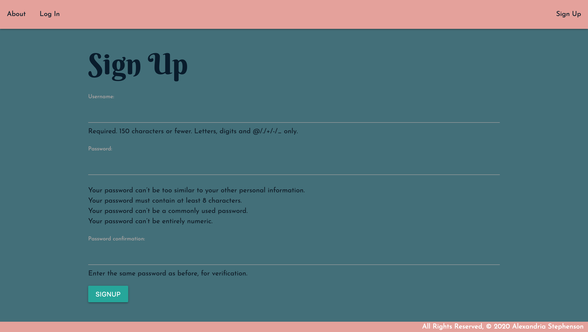
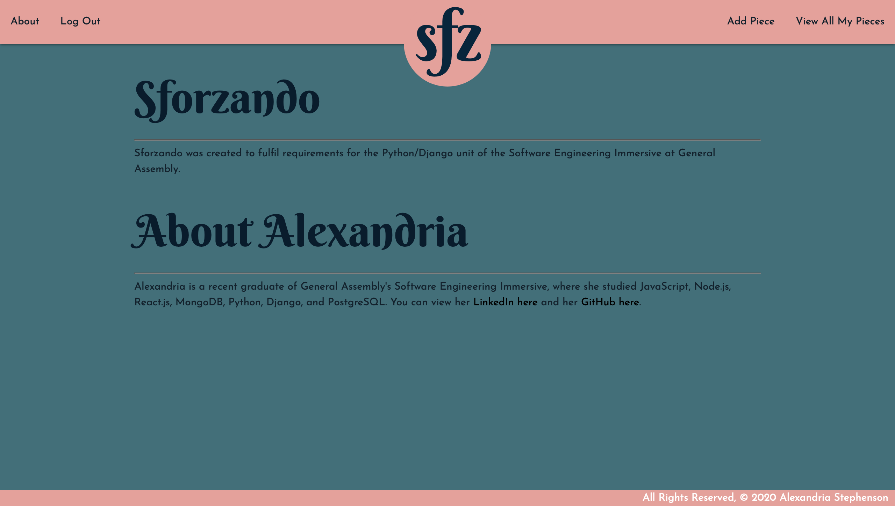
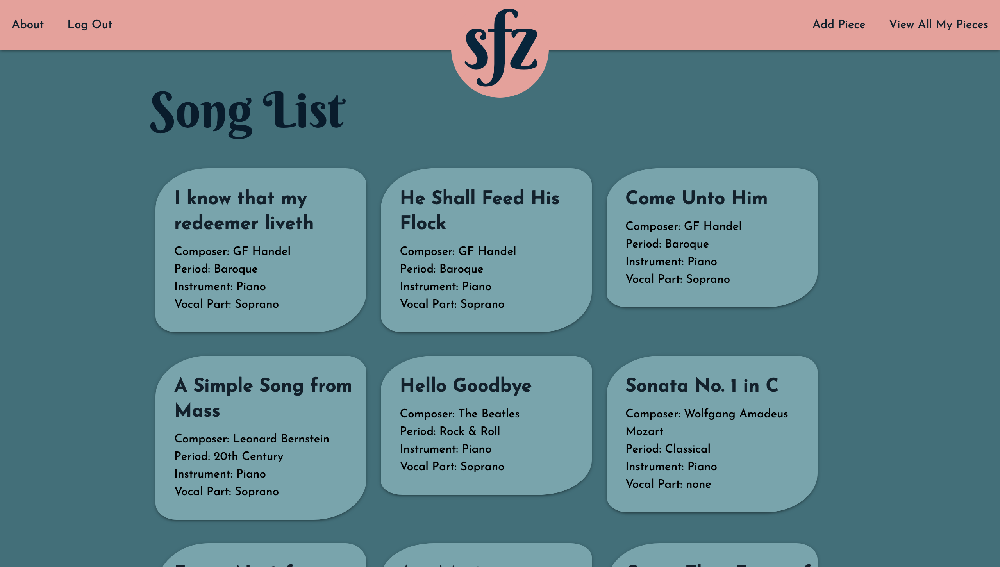
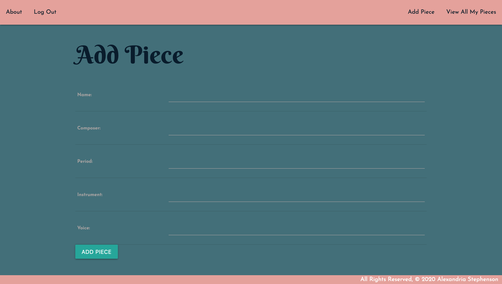

# Sforzando Music Database

- [Sforzando Music Database](#sforzando-music-database)
  - [1. Deployed App:](#1-deployed-app)
  - [2. Public Trello Board](#2-public-trello-board)
  - [5. Screenshots](#5-screenshots)
  - [6. Technologies Used](#6-technologies-used)

## 1. Deployed App:
[Sforzando](https://sforzandodb.herokuapp.com/)

## 2. Public Trello Board
This link includes user stories, ERDs, and Wireframes
[Trello Link](https://trello.com/b/xVXCo6pE/unit-4-project-sforzando)

## 5. Screenshots
 
 
 
 
 

## 6. Technologies Used
* PostgreSQL
* Python
* Django
* HTML
* CSS
* Materialize framework 
* Heroku with Django
* draw.io for ERDs
* Trello for project management
* Whimsical for wireframes
* BoxySVG for logos